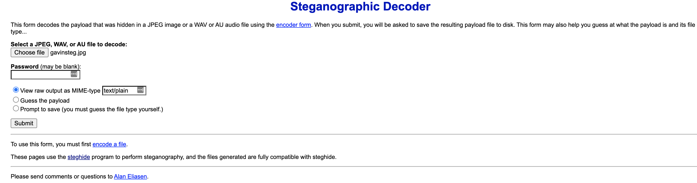
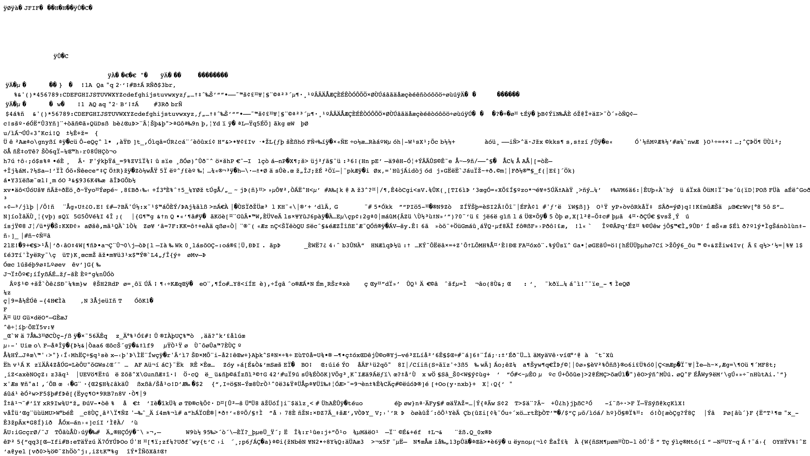
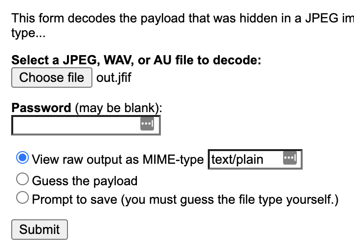

# steg-hiding data
**Points: 180**

Prompt: "i wonder what's hidden...

i wonder what's hidden..."

File provided: "[gavinsteg.jpg](gavinsteg.jpg)"

This was a tough one for me, I initially tried a bunch of steganography decoding tools online but didn't found anything fruitful. Most results were either gibberish or failure to decode.

However, I remembered that steghide could store data in a file within a file. It need not necessarily be plaintext or decoded into a legible format instantly. 
To test this hypothesis, I used this website [https://futureboy.us/stegano/decinput.html](https://futureboy.us/stegano/decinput.html) with steghide as its engine.

First, I uploaded gavinsteg.jpg and chose to view the file in plaintext to see if anything looked recognisable. 

Interestingly we see "JFIF", more on that [here](https://en.wikipedia.org/wiki/JPEG_File_Interchange_Format). So we know that this is a file, now we save it then.

Using the "Prompt to save", I downloaded the file and renamed it [out.jfif](out.jfif)
For those on Windows, you would probably be able to open this in Paint. As a Mac user, I had no readily available option, so I converted it to [out.jpg](out.jpg) to take a look.

Now I was stumped, where do I go from here? If in doubt, throw it into steghide again!
Seeing as the conversion from *.jfif to *.jpg might have removed any meaningful data, I did not get any flag from using out.jpg in steghide.
Instead, throwing in out.jfif, we get the flag in plaintext:

> wh{wh4t_ev3n}
