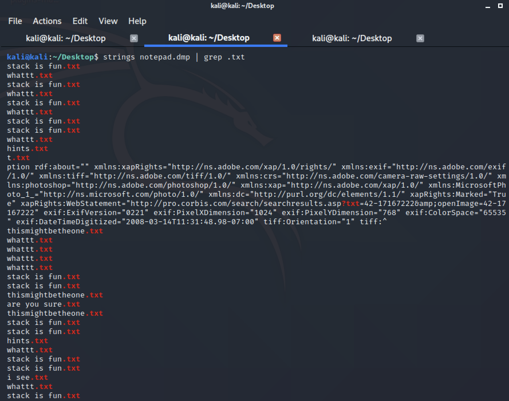
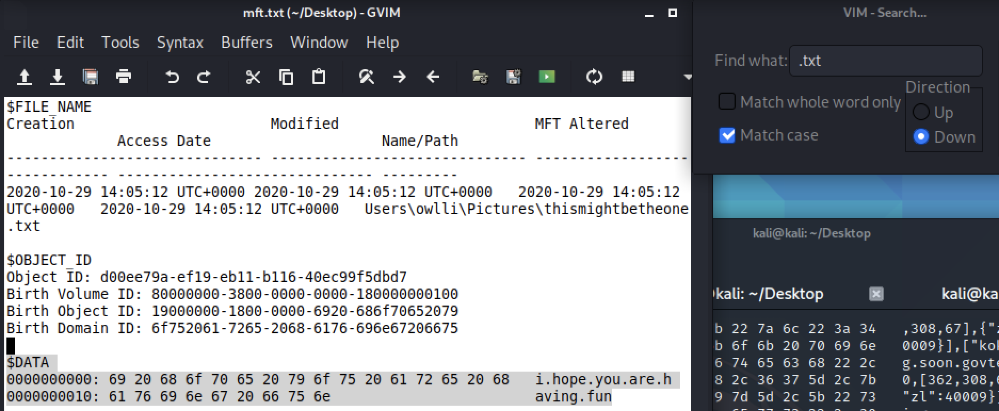
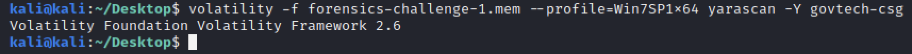
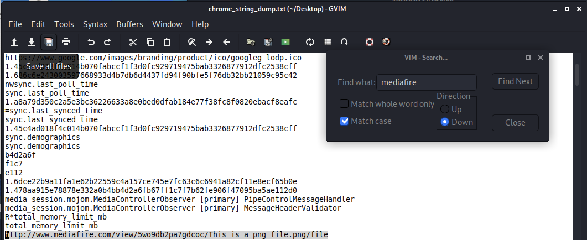
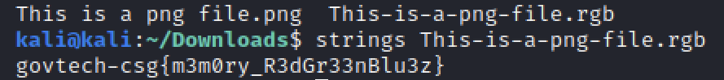

# Walking down a colourful memory lane
**Points: 1000**

Prompt: "We are trying to find out how did our machine get infected. What did the user do?"

File(s) provided: "forensics-challenge-1.mem"

Hint: "Understanding Windows memory"

**The outputs for commands ran can be found in the respective text files**

## My Attempt
Volatility is the go-to tool for memory analysis, this is what we will be using to perform this investigation. I was running a native version of Volatility on Kali Linux, but you could just make use of the Python version, it would work just as well.

Upon obtaining the memory image, the first thing that I did was to identify the OS in which this memory image was taken from. This is crucial because every OS does its memory addressing differently (even between some versions).
> volatility -f forensics-challenge-1.mem kdbgscan
> volatility -f forensics-challenge-1.mem imageinfo

For this, my personal SOP and preference is to run **imageinfo** since it performs a [kdbgscan](kdbgscan.txt) as well. From the results of [imageinfo](imageinfo.txt), Win7SP1x64 is the first profile that is given, the list provided usually tends to be accurate and we can check this by simply running pslist. In the event where no processes show up, the profile is likely to be incorrect.

From here on, every command would be preceded by:
> volatility -f forensics-challenge-1.mem --profile==Win7SP1x64

Since the prompt mentioned the user doing something, I first ran **pslist** to obtain all running processes in memory. Taking a quick look through [pslist](pslist.txt), there didn't seem to be any malicious processes off the bat. Although, there was a significant number of chrome tabs open (he must've been busy with STACK the Flags 2020 as well).

To better visualise the parent-child process relationships, we can run **pstree**. The output of [pstree](pstree.txt) shows us chrome.exe (PID: 2904) opening many other child processes of chrome.exe, logically for me it would make sense to take a look at the parent process first:
> memdump -p 2904 --dump-dir=./
This gives us the memory dump for the parent process chrome.exe with PID of 2904

From the memdump, we can strings it to find any visited links and any other meaningful data:
> strings 2904.dmp

In the [output](chrome_string_dump.txt), I just searched through looking for any interesting links. This was the beginning of my downfall as I spent several hours going through various avenues to no avail. Below is a list of the commands I've ran and the rationale behind each:

1. I attempted to take a look at the notepad.exe memory dump and see if there were any text files opened in notepad that could potentially contain the flag.
  > memdump -p 3896 --dump-dir=./
  strings 3896.dmp | grep .txt

  The [output]() did give me some potentially interesting text files.  This led me to run **mftparser**, since text files are usually relatively small (<1024 bytes), they would be resident in the MFT. We can then look at them through the output in the $DATA section.
  > mftparser > mft.text

  Of course, we got baited by the contents..
  

2. Next I took a jab at **iehistory** in hopes of finding any browsing history. Nothing too intersting here, though it did show us some files accessed by explorer.exe. This behaviour can be explained since iehistory "applies to any process which loads and uses the wininet.dll library, not just Internet Explorer. Typically that includes Windows Explorer as well", as per Part 3 of Andrea Fortuna's guide to Volatility. Output can be found [here](iehistory.txt).

3. The last thing I did was to run a scan through memory with YARA rules using the string "govtech-csg" in hopes of finding the flag somewhere in memory.
> yarascan -Y govtech-csg

  

That was it for my attempts for this challenge, went on to other challenges as I felt this was taking up too much time without any clear leads.

## Solution From Community
At the end of the CTF, I visited the Discord channel for some spoilers to see where I went wrong, only to realise that I had everything that was necessary to find the flag.

The output of running strings (chrome_string_dump.txt) already showed us a mediafire URL at the top of the file, this is the lead necessary to find the flag. Searching for mediafire, there would eventually be a link to a .png image hosted on mediafire.

[Link](http://www.mediafire.com/view/5wo9db2pa7gdcoc/This_is_a_png_file.png/file)

Opening the image gives almost nothing. This is where the word "colourful" in the title of the challenge hints us to the RGB values where the flag is encoded in. Using a [png to rgb converter](https://convertio.co/png-rgb/), I downloaded the converted .rgb file.

Now, running strings on [This-is-a-png-file.rgb](This-is-a-png-file.rgb) we would get the flag:

> strings This-is-a-png-file.rgb
**govtech-csg{m3m0ry_R3dGr33nBlu3z}**

Overall, my workflow was sufficient for me to obtain the flag, but I didn't search hard enough through his Google Chrome history to be able to identify the mediafire link that contained the image to the flag. Much more learning and determination needed for future CTFs, GLHF!

## **Learning Resources/References:**
- My simplified workflow is as follows:
1) imageinfo
2) pslist/pstree
3) memdump interesting processes
4) Run strings on memdump
5) Repeat the process, and make use of other modules as and when potential artefacts are identified

- Andrea Fortuna's series is a good start for learning Volatility:
[Part 1](https://www.andreafortuna.org/2017/06/25/volatility-my-own-cheatsheet-part-1-image-identification/)
[Part 2](https://www.andreafortuna.org/2017/07/03/volatility-my-own-cheatsheet-part-2-processes-and-dlls/)
[Part 3](https://www.andreafortuna.org/2017/07/10/volatility-my-own-cheatsheet-part-3-process-memory/)
- Extracting files from MFT using mftparser:
[Link](https://steemit.com/security/@nybble/forensic-extracting-files-from-mft-table-with-volatility-part-2-en)
