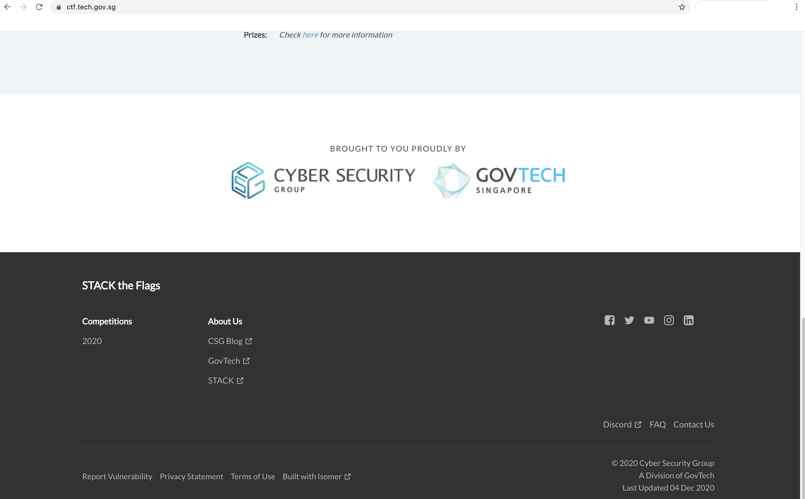
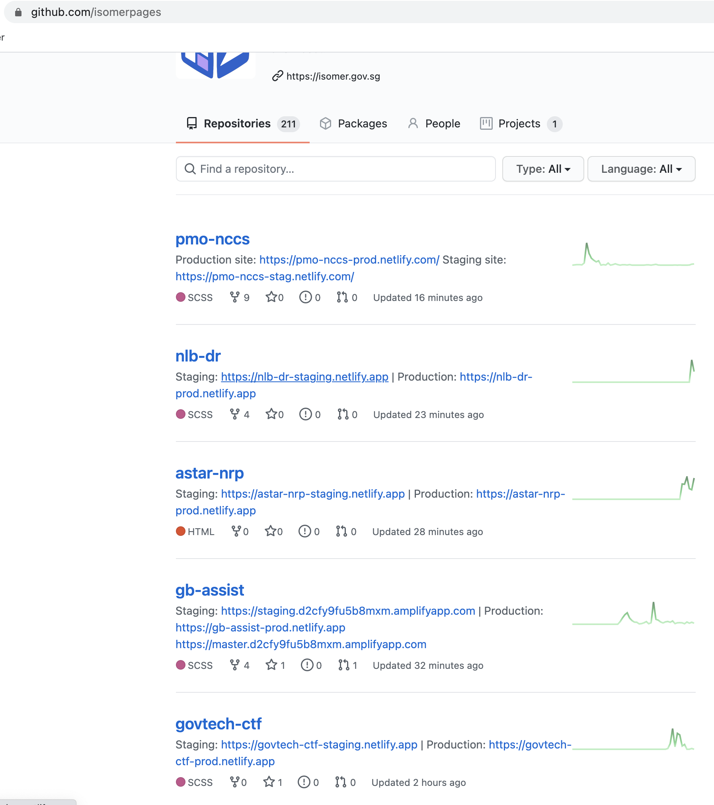
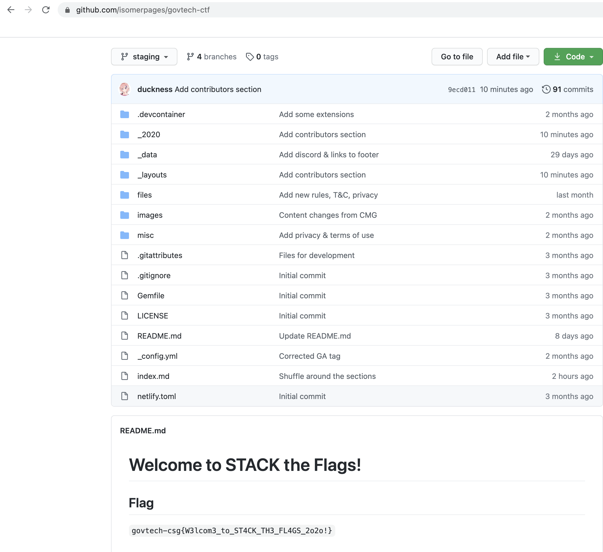

# Welcome Challenge
**Points: 1000**

Prompt: Welcome to STACK the Flags 2020! This is a welcome challenge to get you started. Can you find the flag hidden on our [website](https://ctf.tech.gov.sg/)? (Please DO NOT attack/scan the web service! The challenge does not require you to attack the site, subdomains, or root domain!)

Addendum:
Treat the website as a starting point. The goal is to gain enough prerequisite knowledge to be able to find the flag "on" the website. Treat this challenge similar to an OSINT challenge, find out more about the website.

## My Attempt
Challenge might seem very tough at the start since there really isn't much information to go off except the website that we should be looking at. With the addendum's use of the word "on" makes it a little bit clearer as to where we should proceed. Much like one of the OSINT challenges that requires us to look at [http://developer.tech.gov.sg/](http://developer.tech.gov.sg/), one would realise that something similar is going on here.

The template for http://developer.tech.gov.sg/ can be found on Github, where they push and make changes using a web framework of sorts. It is at the bottom of https://ctf.tech.gov.sg that we see the website is "[Built with Isomer](https://www.isomer.gov.sg/)", a similar concept of having a template for rapid deployment of websites. 

Now, we just have to find the Github page for Isomer, which with a simple Google search would yield us: [https://github.com/isomerpages](https://github.com/isomerpages)

Scrolling through we would see the govtech-ctf repository that is likely to be hosting the webpage given to us. 

Viewing the repository, we have the flag in the README.md. 

The flag is:
> **govtech-csg{W3lcom3_to_ST4CK_TH3_FL4GS_2o2o!}**
