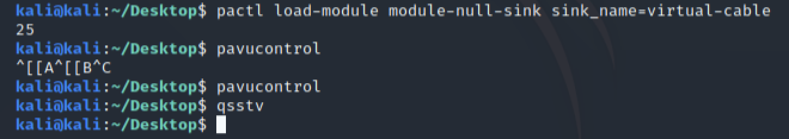
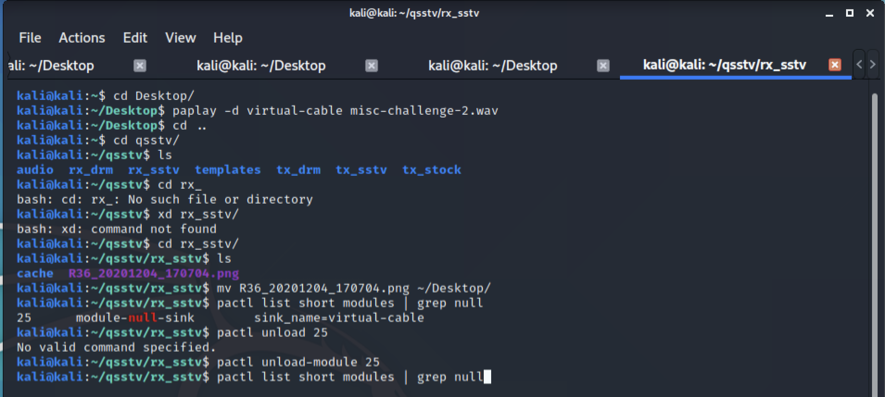
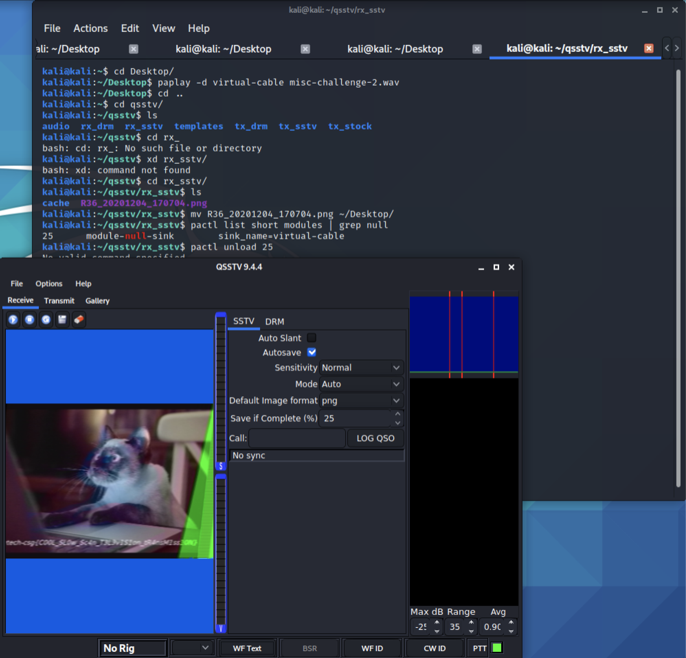
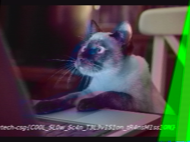

# Beep Boop
**Points: 1000**

Prompt: As part of forensic investigations into servers operated by COViD, an investigator found this sound file in a folder labeled "SPAAAAAAAAAAAAAAAAAACE". Help us uncover the secret of the file.

File(s) provided: "[misc-challenge-2.wav](misc-challenge-2.wav)"

Hint 1: Apollo 7, 8 and 9 transmitted images in this way!

Hint 2: Easter eggs transmission sound that was found in popular games like Portal / Portal 2!

Hint 3: Take a look at Google Play store for useful tool!

## My Attempt
As I just so happened to explore some of picoCTF's 2019 challenges, this challenge drew some similarities with one that I managed to complete. Particularly the use of the word "SPAAAAAAAAAAAAAAAAAACE" as the folder name, as well as the given audio file.

To walk us through, Apollo 7, 8, 9 made use of Slow Scan TV (SSTV) as means of transmitting images back to Earth. As such, what we need is a decoder for SSTV audios.

Following the same process as the [m00nwalk](https://github.com/Dvd848/CTFs/blob/master/2019_picoCTF/m00nwalk.md) challenge, I ran the following commands:
> apt-get install qsstv #install the sstv decoder
pactl load-module module-null-sink sink_name=virtual-cable #creating a virtual cable that outputs to null
pavucontrol #ensuring we are outputting to null
qsstv

> paplay -d virtual-cable misc-challenge-2.wav #playing the audio into qsstv
pactl unload-module <virtual cable no.> #cleaning up

This should be the output from qsstv, which we can then download the image to get a better view of the flag.

The flag is:
> **govtech-csg{C00L_SL0w_Sc4n_T3L3v1S1on_tR4nsM1ss10N}**

## **Learning Resources/References:**
- picoCTF 2019's [m00nwalk](https://github.com/Dvd848/CTFs/blob/master/2019_picoCTF/m00nwalk.md) writeup
