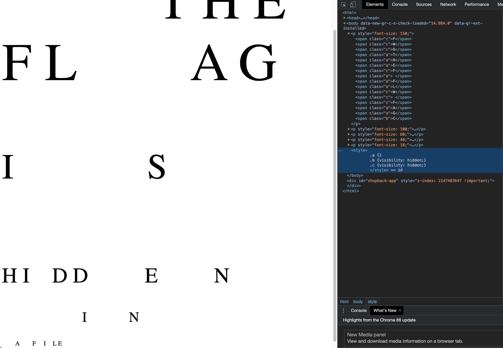
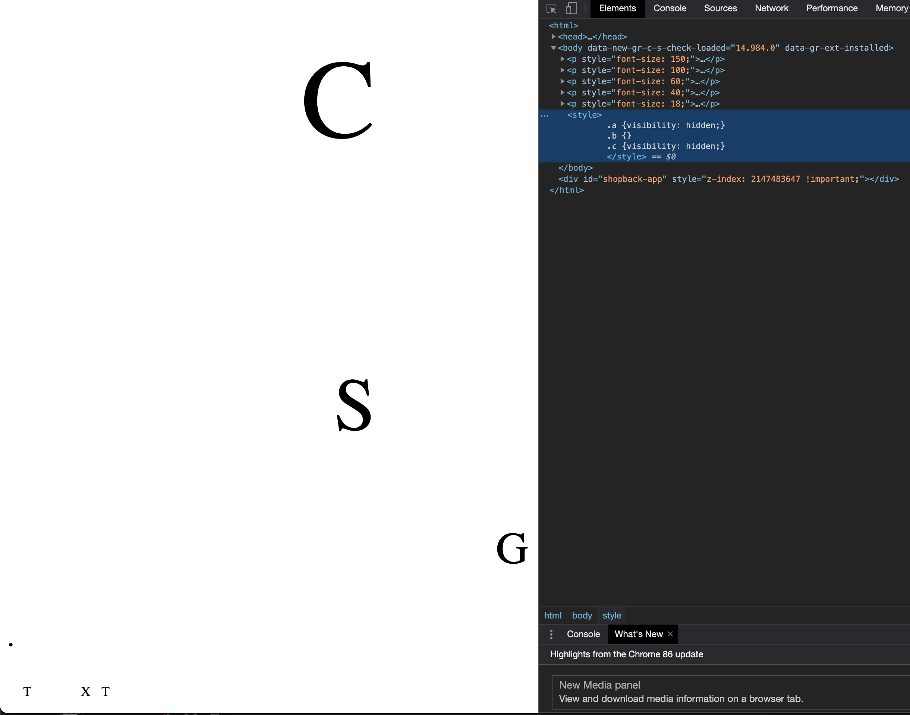
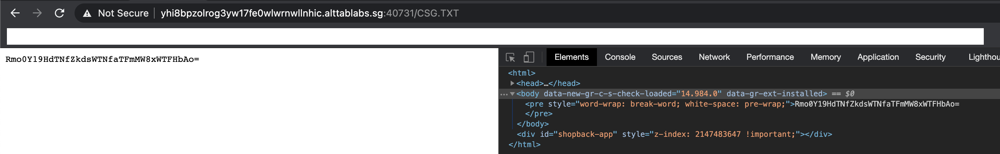
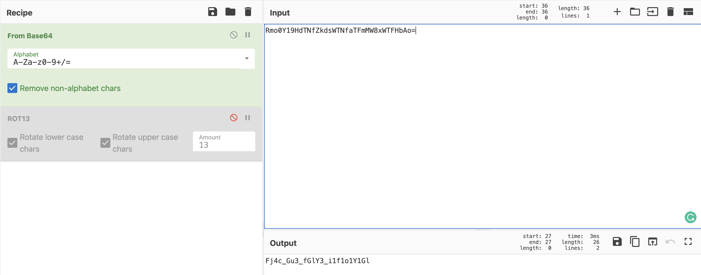
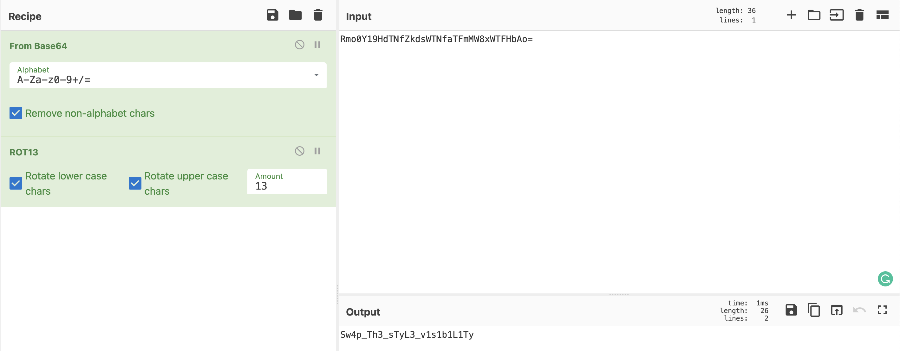

# FWO FWF
**Points: 1000**

Prompt: As part of forensic investigations into servers operated by COViD, an investigator found this web server containing a hidden secret. Help us find the contents of this secret.

Addendum:
If you're having trouble, check your capitalization.

## My Attempt
Opening up the webpage, we see a bunch of characters, particularly the FWO FWF on the first line. There doesn't really seem to be much on this webpage, so let's inspect it.

What we see here is several HTML object classes, with each character tagged to a particular class. There is also an element that controls the visibility of the classes 'a', 'b', 'c'.

Instinctually, let us play around with the visibility, since it seems that there are other characters not displayed, for good reason. Toggling the class 'b' and 'c' to be hidden, we get the following message: **the flag is hidden in a file**

Now the real question is where is this file on the webserver? We would need to know the name of the file to begin with. Accessing sitemap.xml or Robots.txt gave us nothing in terms of indexing the webserver's contents.

That is when I noticed the '.' characters when none of the classes are hidden.. Could it be that the filename is hiding under our nose just like the clue we found? Changing the class 'a' and 'c' to be hidden, we now see what looks to be a filename: [**CSG.TXT**](CSG.TXT)

Accessing <webserver>/CSG.TXT, we would then obtain the following base64 encoded string: **Rmo0Y19HdTNfZkdsWTNfaTFmMW8xWTFHbAo=**

Let us open up [CyberChef](https://gchq.github.io/CyberChef/) and decode this string to ASCII.

Something still seems off, '_' exists but the alphabets look jumbled up. Perhaps a ROT13?

Viola, the flag is:
> **govtech-csg{Sw4p_Th3_sTyL3_v1s1b1L1Ty}**
