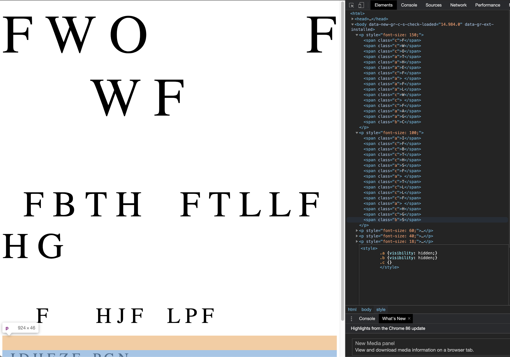

# FWO FWF
**Points: 1000**

Prompt: As part of forensic investigations into servers operated by COViD, an investigator found this web server containing a hidden secret. Help us find the contents of this secret.

Addendum:
If you're having trouble, check your capitalization.

## My Attempt
Opening up the webpage, we see a bunch of characters, particularly the FWO FWF on the first line. There doesn't really seem to be much on this webpage, so let's inspect it.

What we see here is

The flag is:
> **govtech-csg{C00L_SL0w_Sc4n_T3L3v1S1on_tR4nsM1ss10N}**
