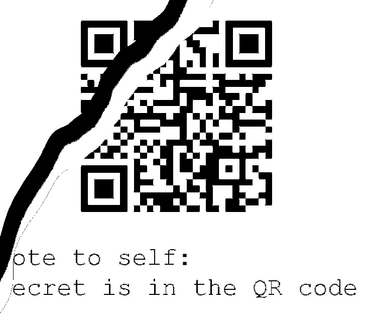

# REconstrucQ
**Points: 1000**

Prompt: As part of forensic investigations into servers operated by COViD, an investigator found this picture of a partially torn paper containing a QR Code. Can you recover the data within the QR Code?

File(s) provided: "[misc-challenge-4.png](misc-challenge-4.png)"

## My Attempt
Looks like we are presented with a damaged QR code and the flag is stored within.. 

Doing a quick Google search on damaged QR codes, we can find some articles on how QR codes are actually decoded. This [link](http://www.datagenetics.com/blog/november12013/index.html) on wounded QR codes provides us an understanding of how much damage a QR code can take before it can no longer be used.

My teammate decided to check for stego on the file, hoping to find something of use. He used StegoSolve to do it, but I found an online tool called [StegOnline](https://stegonline.georgeom.net/image) that works the same. We first can get the desired image by removing the transparency.

Interestingly, we would find a part of the image that has been cut off.  This actually makes it a lot easier for us to reconstruct this QR code.
Initially, I attempted to reconstruct and manually decode the data in the QR code. [(Reference)](https://medium.com/@r00__/decoding-a-broken-qr-code-39fc3473a034) You can see how far I got in this excel file: [qr.xlsx](qr.xlsx).

Now all we have to do, since we know from the first blogpost that QR codes have strong levels of error recovery, we just need to fill up any gaps and remove any extraneous black markings as in the case of the "tear". Any image editing software would work for this. Hence we get the following:

Scanning it on my phone, we would then get the flag stored in the QR code. 

Viola, the flag is:
> **govtech-csg{QR_3rr0r_R3c0v3ry_M4giC!}**
