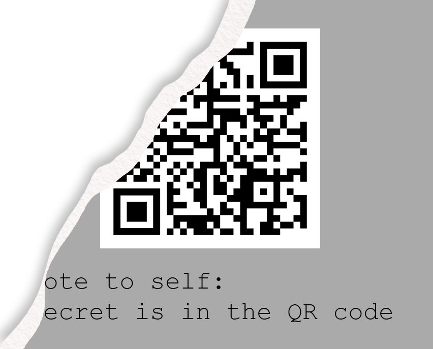

# REconstrucQ
**Points: 1000**

Prompt: As part of forensic investigations into servers operated by COViD, an investigator found this picture of a partially torn paper containing a QR Code. Can you recover the data within the QR Code?

File(s) provided: "[misc-challenge-4.png](misc-challenge-4.png)"

## My Attempt
Looks like we are presented with a damaged QR code and the flag is stored within.. 

Doing a quick Google search on damaged QR codes, we can find some articles on how QR codes are actually decoded. This [link](http://www.datagenetics.com/blog/november12013/index.html) on wounded QR codes provides us an understanding of how much damage a QR code can take before it can no longer be used.

TBC

Viola, the flag is:
> **govtech-csg{dumpster_diving_is_impressive}**

Initially, I attempted to reconstruct and manually decode the data in the QR code. [Reference](https://medium.com/@r00__/decoding-a-broken-qr-code-39fc3473a034)
