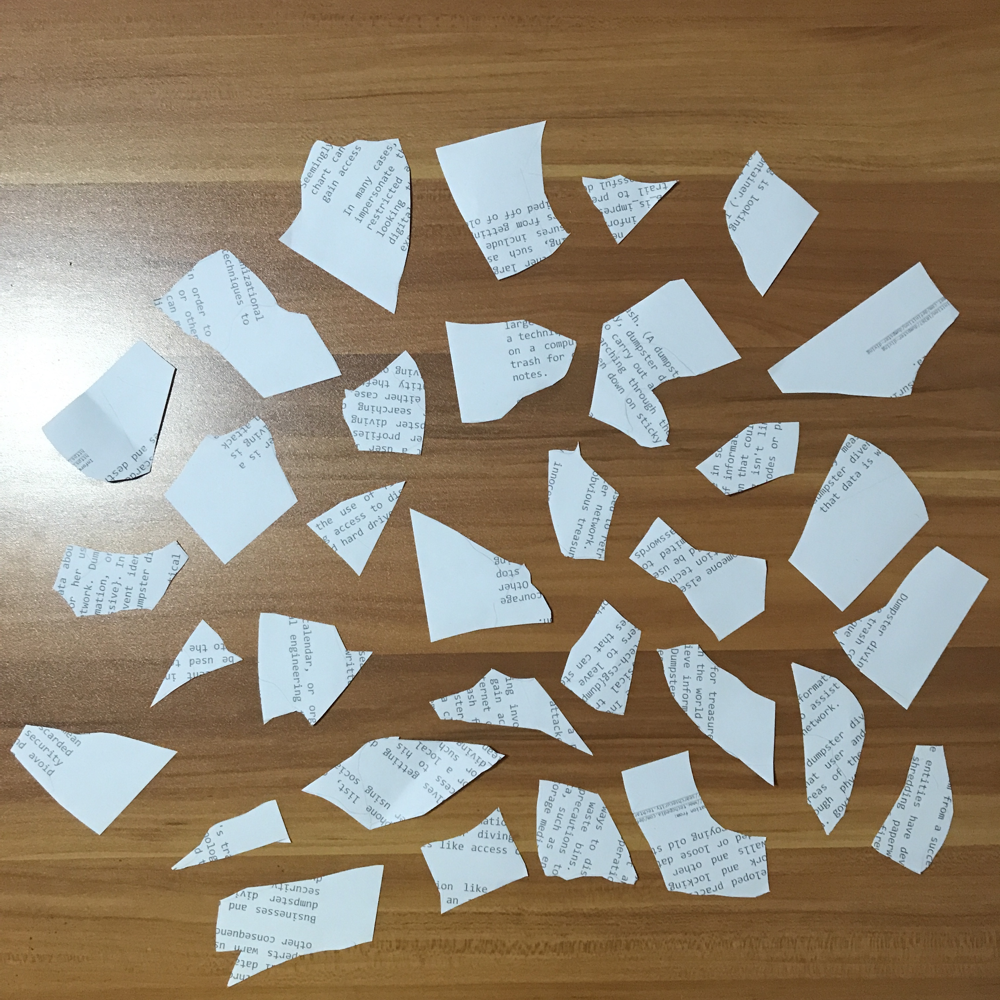
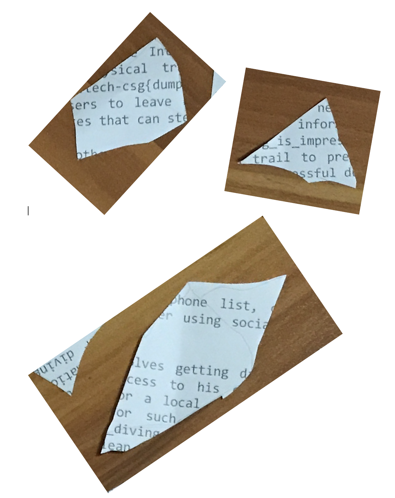

# Diving in
**Points: 1000**

Prompt: We found some papers in the bin. Retrieve the flag!

File(s) provided: "[misc-challenge-6.jpeg](misc-challenge-6.jpeg)"

## My Attempt
Looks like the flag has been separated into various fragments of this paper. 

Looking through each fragment, we can identify the structure of a flag from '_', 'govtech-csg' and '{}'. What I then did was to open up a Word document, and cut out fragments that contained these elements, pasting them into the Word document. I then rotated them to be upright, and we can begin to see what looks to be the flag. 

Making an educated guess gives the following: **dumpster_diving_is_impressive**

Viola, the flag is:
> **govtech-csg{dumpster_diving_is_impressive}**
