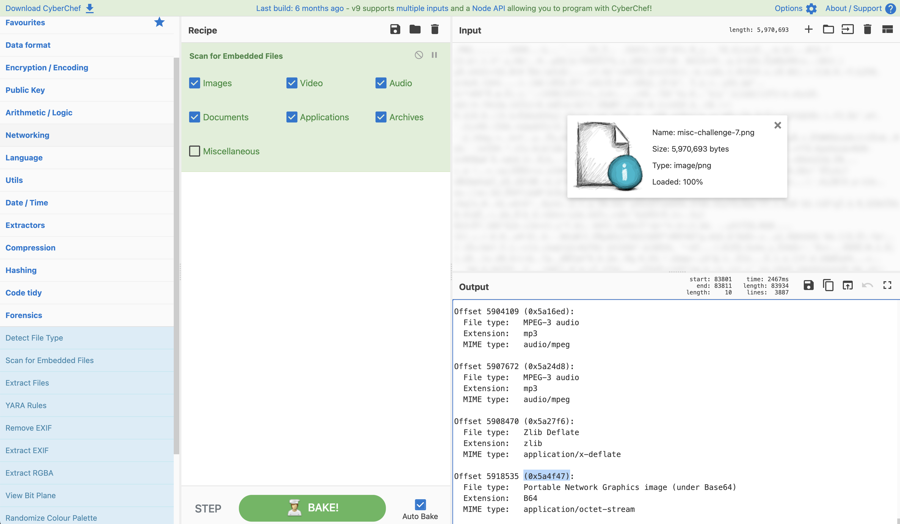
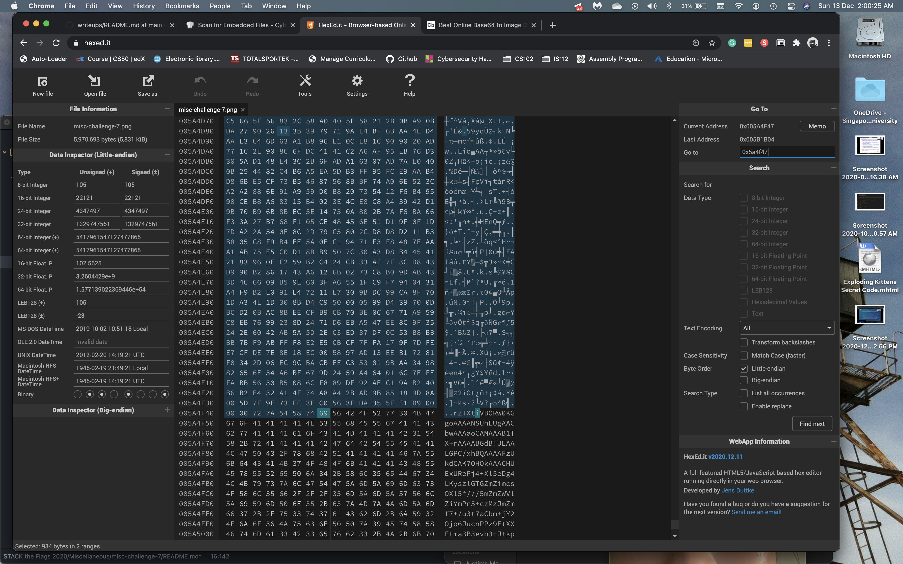
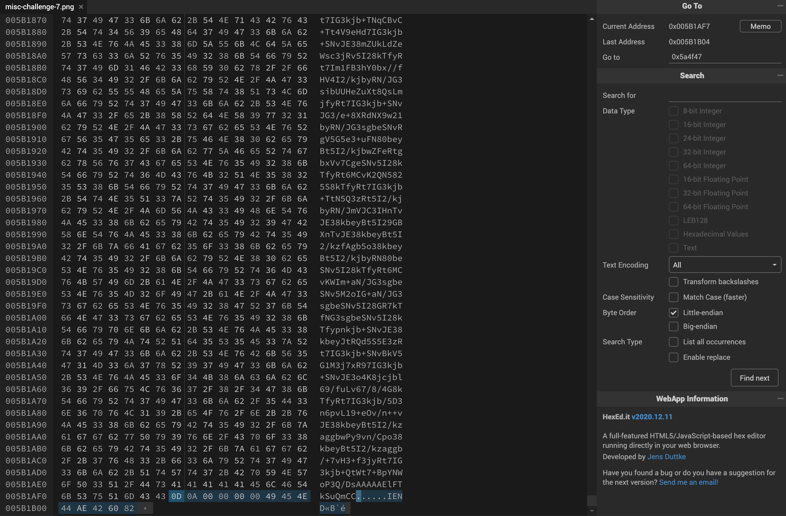
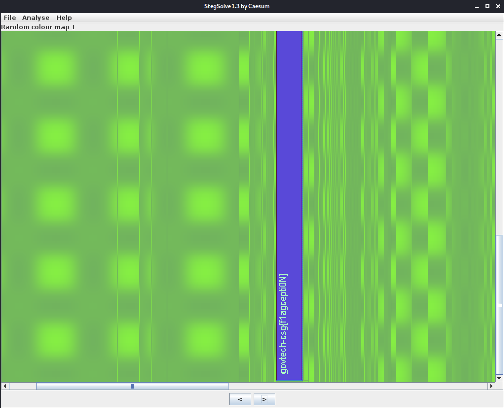

# Where's the flag?
**Points: 1000**

Prompt: There's plenty of space to hide flags in our spacious office. Let's see if you can find it!

File(s) provided: "[misc-challenge-7.png](misc-challenge-7.png)"

## My Attempt

The prompt uses the words "plenty of space to hide flags", which seems to suggest that there is some sort of embedded file within the given image.

Opening up [CyberChef](https://gchq.github.io/CyberChef/) we can make use of the "Scan For Embedded Files" recipe to dig further and confirm our suspicions. Without surprise, we see that there is actually a hidden PNG image at the Offset 5918535 (0x5a4f47), we now just need to extract this file. It is worth noting that the PNG is base64 encoded, as such we would need to decode it to obtain the image. 

To get this base64 string, we can open the image in a hex editor, [hexed.it](hexed.it) would be sufficient for this task. The first thing we do is to navigate to 0x5a4f47 and to delete everything before it since we know that our image starts here. (Alternatively, you could copy every byte from there to EOF)
The last thing we need to do is to delete the bytes that belong to the original PNG image, the "IEND" chunk marker as well as any null bytes. 

Now just save this as a [.txt](embedded.txt) file and we will then copy the contents into a [base64 to image decoder](https://codebeautify.org/base64-to-image-converter). This would then give us the following image: 

Throwing this into the [stegsolve](https://github.com/zardus/ctf-tools/blob/master/stegsolve/install) tool we can check if there is any embedded flag within the image of a flag.
> java -jar stegsolve.jar

Looking through the various planes, we would eventually see the flag in the Random Colour Maps section. 

Viola, the flag is:
> **govtech-csg{f1agcepti0N}**
