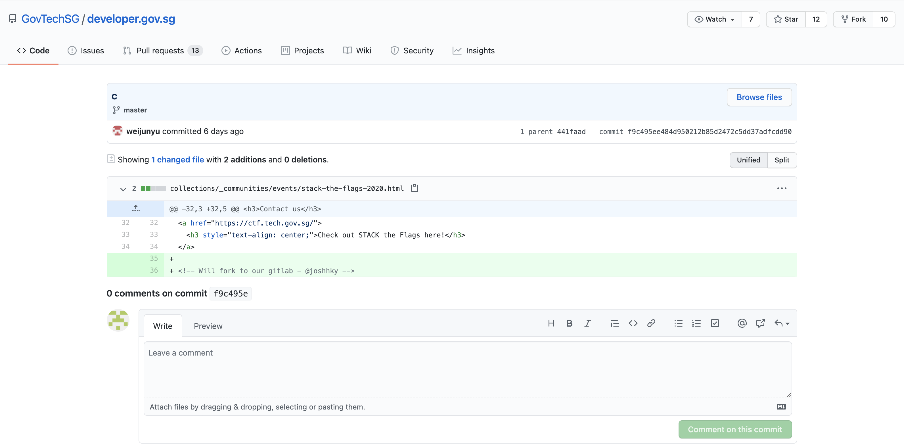

# What is he working on? Some high value project?
**Points: 1000**

Prompt: The lead Smart Nation engineer is missing! He has not responded to our calls for 3 days and is suspected to be kidnapped! Can you find out some of the projects he has been working on? Perhaps this will give us some insights on why he was kidnapped…maybe some high-value projects! This is one of the latest work, maybe it serves as a good starting point to start hunting.

Flag is the repository name!

[Developer's Portal - STACK the Flags](https://www.developer.tech.gov.sg/communities/events/stack-the-flags-2020)

Note: Just this page only! Only stack-the-flags-2020 page have the clues to help you proceed. Please do not perform any scanning activities on www.developer.tech.gov.sg. This is not part of the challenge scope!

## My Attempt
Going to the [Developer's Portal](https://www.developer.tech.gov.sg/communities/events/stack-the-flags-2020), we are faced with some information with regards to STACK the Flags 2020. However, that is all we see at face value, no leads, social media handles, or links to direct us elsewhere. 

Seeing as the advise was to just stick to the page, perhaps it is something that we are not seeing.. Inspecting the HTML code for the page, we then notice something after some digging around, what looks to be a note left by a developer? 
**"Will fork to our gitlab - @joshhky"**

Interestingly, the webpage can be found on GovTech's Github under the developer.gov.sg webpage. 

Now let's bite onto that lead and explore [@joshhky's gitlab](https://gitlab.com/joshhky), perhaps we could find the high value project as mentioned by the challenge prompt.  He seems to have quite some contribution to this "korovax-employee-wiki" repository, especially since he is involved in creating a POC.

Taking a look at that repository and its README.md, we see that @joshhky was assigned to take care of the **krs-admin-portal** repository which should not be made public. 

Seems like @joshhky is part of the Korovax (sounds like corona vaccine) project, hence this could be why COV1D is targeting him for his contribution to a repository containing business data.

Hence, the flag is:
> **govtech-csg{krs-admin-portal}**
