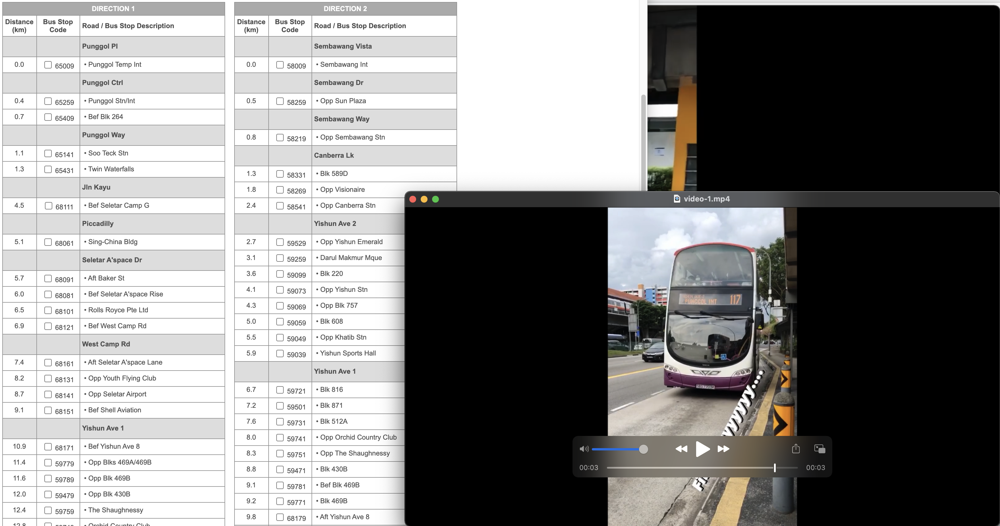
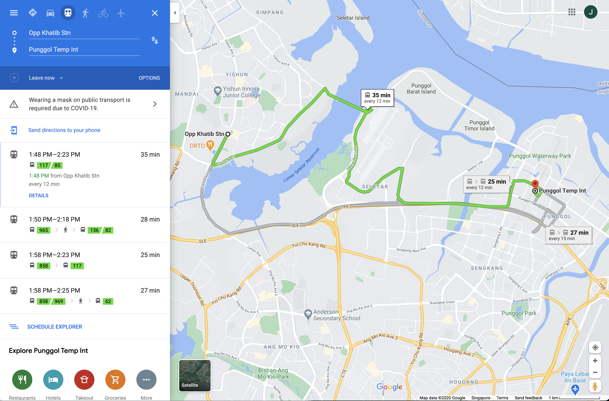
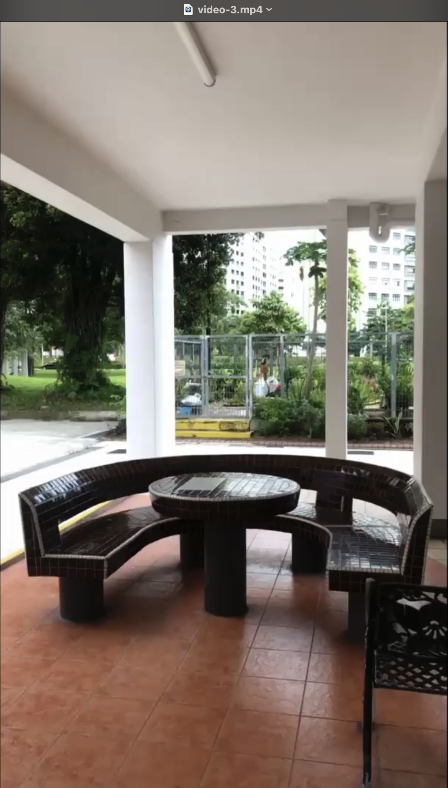
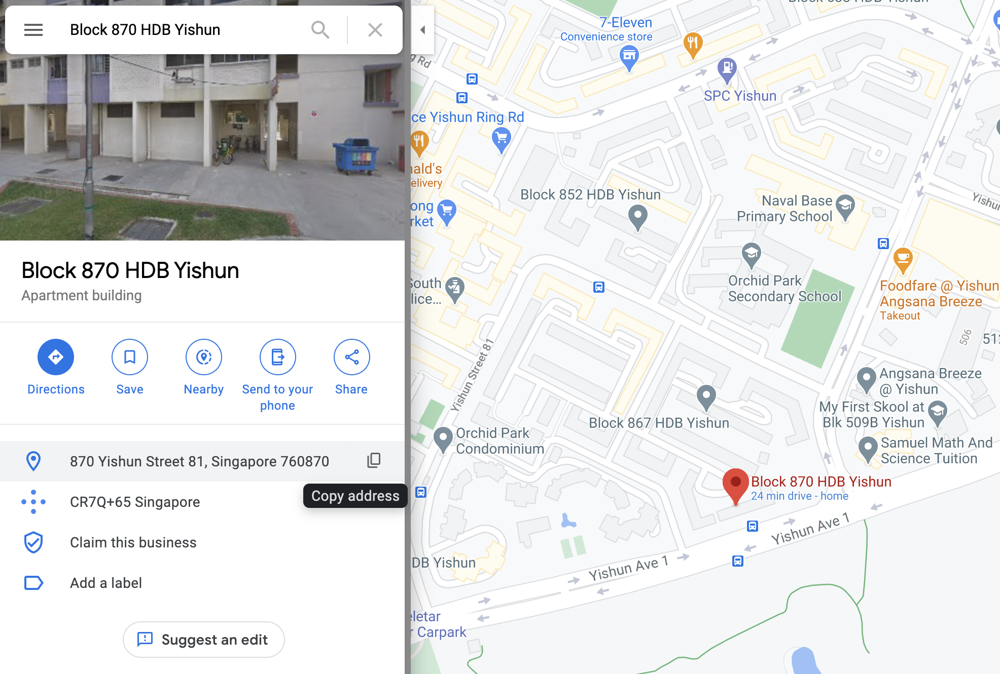

# Where was he kidnapped?
**Points: 1000**

Prompt: The missing engineer stores his videos from his phone in his private cloud servers. We managed to get hold of these videos and we will need your help to trace back the route taken he took before going missing and identify where he was potentially kidnapped!

You only have limited number of flag submissions!

Flag Format: govtech-csg{postal_code}

File(s) provided: [video-1.mp4](video-1.mp4), [video-2.mp4](video-2.mp4), [video-3.mp4](video-3.mp4)

## My Attempt
We will systematically look through each video and situate the movement of our missing engineer. In the first video, we see that he seems to be boarding bus 117, heading towards Punggol Interchange, and is currently in the Yishun Ave. 2 area. 
We can open up the bus 117 [service route guide](https://www.transitlink.com.sg/eservice/eguide/service_route.php?service=117) by TransitLink to narrow down his current location.

We also notice that the bus stop is right beside an MRT station, which leaves us with 2 options, Yishun and Khatib MRT. Opening up Street View, we now know for sure that he was at Opp Khatib Station, given the similarities in features of the MRT station. 

In the second video, we see that he is walking into a residential area with a distinctive yellow pillar structure. Suppose that our missing engineer took the bus, we can follow his route and look out for this feature in Google Street View. We first map out his route in Google maps by placing the destination to be Punggol Int and our starting destination as Opp Khatib Stn. 

Thankfully, he didn't travel far, and in Street View, we see that he seems to have alighted at Blk 871 where the yellow pillars reside. 

On to the final video, we see that he was under one of the void decks that had a circular table as well as some greenery behind.  We also know that he walked inwards from the Blk 871 bus stop, this information would be useful for us to find out which block he was kidnapped.

Going back to Street View, we see a Blk 870 just behind the bus stop. Taking a look at the carpark, it seems like we have found the circular table that matches with the video, along with some greenery in the background. 

Thus, we now know that he was kidnapped at Blk 870 Yishun Street 81 with postal code **760870**.

The flag is:
> **govtech-csg{760870}**
