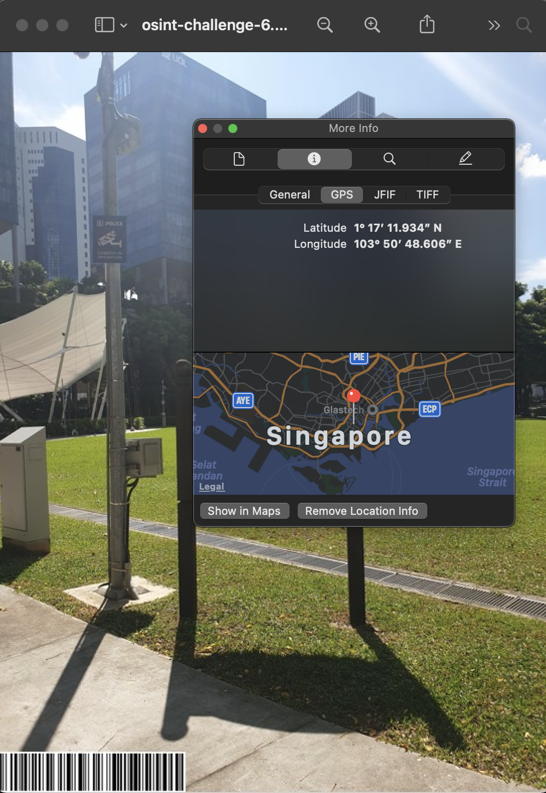
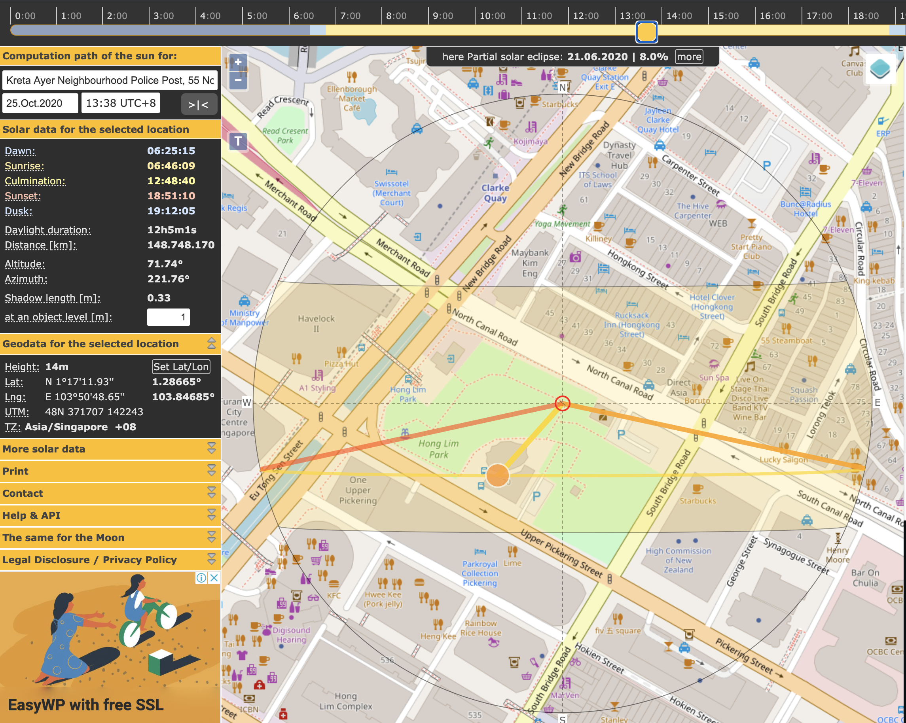
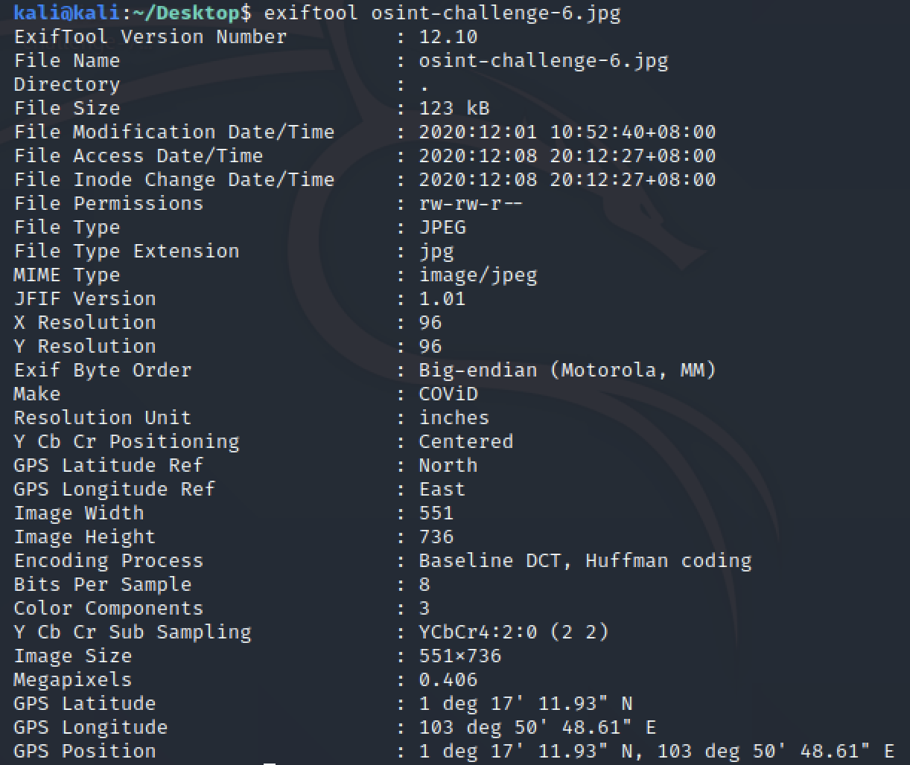

# Only time will tell!
**Points: 1000**

Prompt: This picture was taken sent to us! It seems like a bomb threat! Are you able to tell where and when this photo was taken? This will help the investigating officers to narrow down their search! All we can tell is that it's taken during the day!

If you think that it's 7.24pm in which the photo was taken. Please take the associated 2 hour block. This will be 1900-2100. If you think it is 10.11am, it will be 1000-1200.

Flag Example: govtech-csg{1.401146_103.927020_1990:12:30_2000-2200}
Use this [calculator](https://www.pgc.umn.edu/apps/convert/)!

Flag Format: govtech-csg{lat_long_date_[two hour block format]}

Addendum:
- The amount of decimal places required is the same as shown in the example given.
- CLI tool to get something before you convert it with the calculator.

File(s) provided: "[osint-challenge-6.jpg](osint-challenge-6.jpg)"

**The outputs for commands ran can be found in the respective text files**

## My Attempt
By breaking down the challenge, we can simplify it into 3 parts: **Coordinates, Date, Time**.

Let us first check if there is any location data in the metadata of the image. Opening it on MacOSX, we can see the coordinates.

Putting these coordinates into the [calculator](https://www.pgc.umn.edu/apps/convert/) yields the following:
**Latitude: 1.286648**
**Longitude: 103.84685**
These would turn out to be incorrect, but more on that later.

Next, I went on to find out what was in the barcode. [Cropping it out](barcode.png) and uploading it to an [online barcode scanner](https://online-barcode-reader.inliteresearch.com/) returned the date **25 October 2020**. This is likely to be the date for when the picture was taken. 

Now, we would need to determine the time in which this picture was taken. Of course, we could just bruteforce all possible timings from when the sun is up, but what fun would that be. This [Medium article](https://medium.com/quiztime/lining-up-shadows-2351ae106cec) illustrates how we will go about finding the timeframe that the pictures was taken.

Following the steps, we first key in the coordinates into Google Maps to situate ourselves. We then use Street View to identify any landmarks in the background of the image. We now know that there is a Parkroyal as well as the UOL building directly behind the Speaker's Corner.

As the shadow in the given image is coming from the back, we can use this information in [SunCalc](suncalc.org). After keying in the coordinates and the date derived from the barcode, we shift our focus to the slider at the top of the webpage. We will drag it until the position of the sun aligns with the Parkroyal and UOL building, this would generate the desired shadow in the given image.  Here we see that the time is at about 1338, which would give us the 2 hour block of **1300-1500**.

Constructing the flag, we now have:
govtech-csg{1.286648_103.84685_2020:10:25_1500-1700}

However, this wasn't the correct flag, and in troubleshooting this, the addendum said to use a CLI tool, directing me to exiftool. Interestingly, using exiftool gave us a slightly different Lat/Long, likely due to the decimal place rounding which resulted in different coordinates when we put it into the calculator.  This time, we got the following:
**Latitude: 1.286647**
**Longitude: 103.846836**

Hence, the constructed and accepted flag:
> **govtech-csg{1.286647_103.846836_2020:10:25_1500-1700}**

## **Learning Resources/References:**
- [https://medium.com/quiztime/lining-up-shadows-2351ae106cec](https://medium.com/quiztime/lining-up-shadows-2351ae106cec)
- Information on EXIF metadata in images: [Link](https://linuxhint.com/get_filea_metadata_exif_tool/)
