# Hunt him down!
**Points: 1000**

Prompt: After solving the past two incidents, COViD sent a death threat via email today. Can you help us investigate the origins of the email and identify the suspect that is working for COViD? We will need as much information as possible so that we can perform our arrest!

Example Flag: govtech-csg{JohnLeeHaoHao-123456789-888888}

Flag Format: govtech-csg{fullname-phone number[9digits]-residential postal code[6digits]}

File(s) provided: "[osint-challenge-8.eml](osint-challenge-8/eml)"

## My Attempt
We are first provided with a .eml file, this is a file that usually contains raw email data. In forensics, we might be faced with a large number of .eml files, and parsing them can be a trouble. This Python [eml parser](https://github.com/GOVCERT-LU/eml_parser) tends to be a good package for automating the parsing of a large number of .eml files.

Seeing as this file is small and just a single email, we can just *cat* it to take a look at the contents.
> cat osint-challenge-8.eml
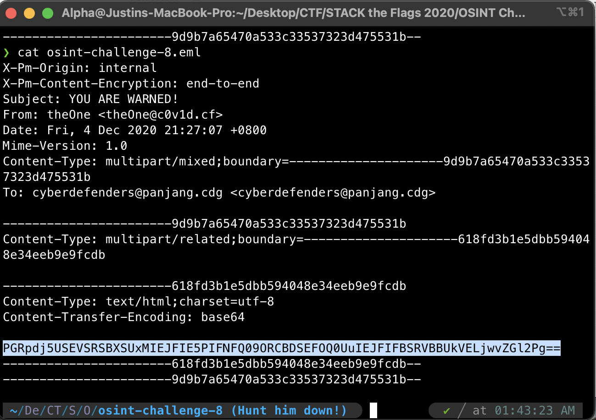

From the email, we can gather the following information:
- Subject: YOU ARE WARNED!
- From: theOne <theOne@c0v1d.cf>
- To: cyberdefenders@panjang.cdg

We can also see that there is a base64 encoded string, that when converted into ASCII, would give us the message of this email: "THERE WILL BE NO SECOND CHANCE. BE PREPARED."
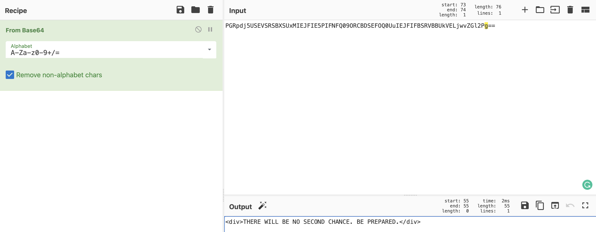

Now the goal of the challenge is to look for the information on the sender that is threatening us. The first avenue would be a simple whois lookup, that could hopefully give us details on the registrar of the c0v1d.cf domain. Unfortunately, this does not give us much. 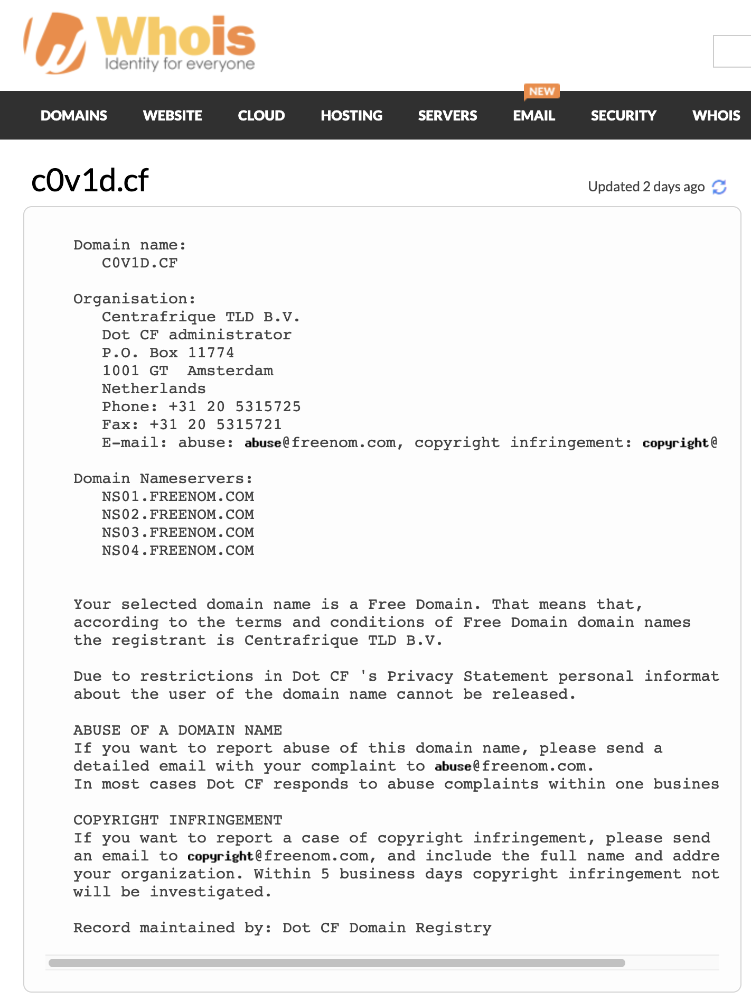

Perhaps a DNS lookup might yield more information, and indeed it did. Going to [dnsdumpster.com](dnsdumpster), we would then see a TXT record that gives us a potential lead.
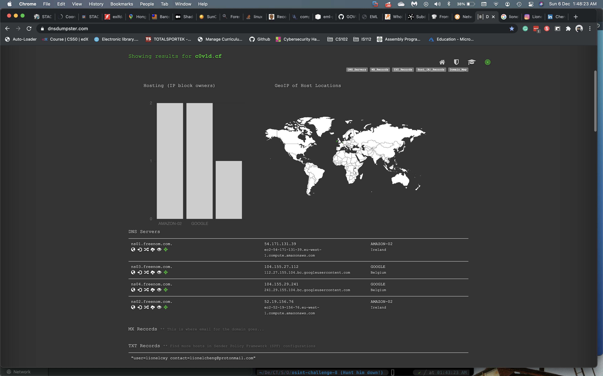

**"user=lionelcxy contact=lionelcheng@protonmail.com"**

Now let us perform a Google search on this lionelcxy user.

Off the bat, we are already getting a bunch of information that could be of use to us, we found 3 accounts that could belong to our suspect: Instagram, LinkedIn, Carousell.

Thankfully his Instagram page is public, and we can get some rudimentary information on his lifestyle. Below you will see two of his posts that would link us to some of his habits and interests.
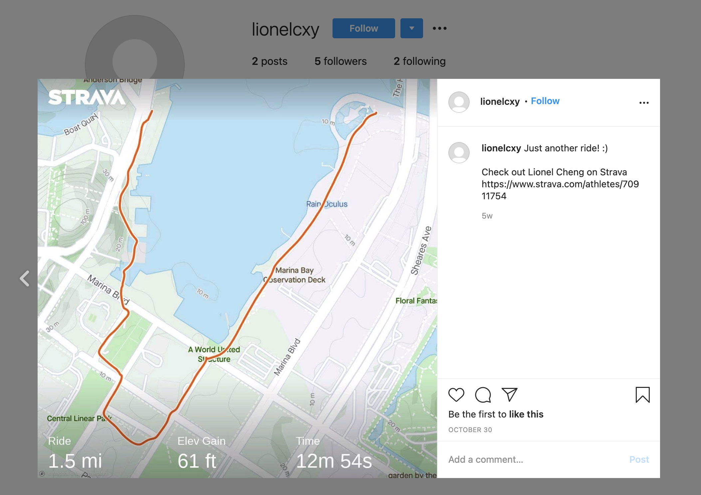
Looks like our guy Lionel enjoys cycling, and even included his Strava profile page, something to explore more later.
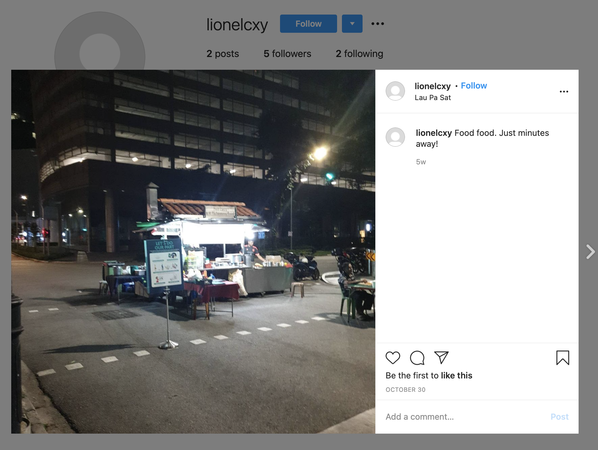
The geotag for this post tells us that he lives nearby LauPaSat, something that would be useful for us to identify his residential address/postal code.

Taking a look at his [LinkedIn profile](https://www.linkedin.com/in/cheng-xiang-yi-0a4b891b9/?originalSubdomain=sg), we now know his full name to be **Lionel Cheng Xiang Yi**. 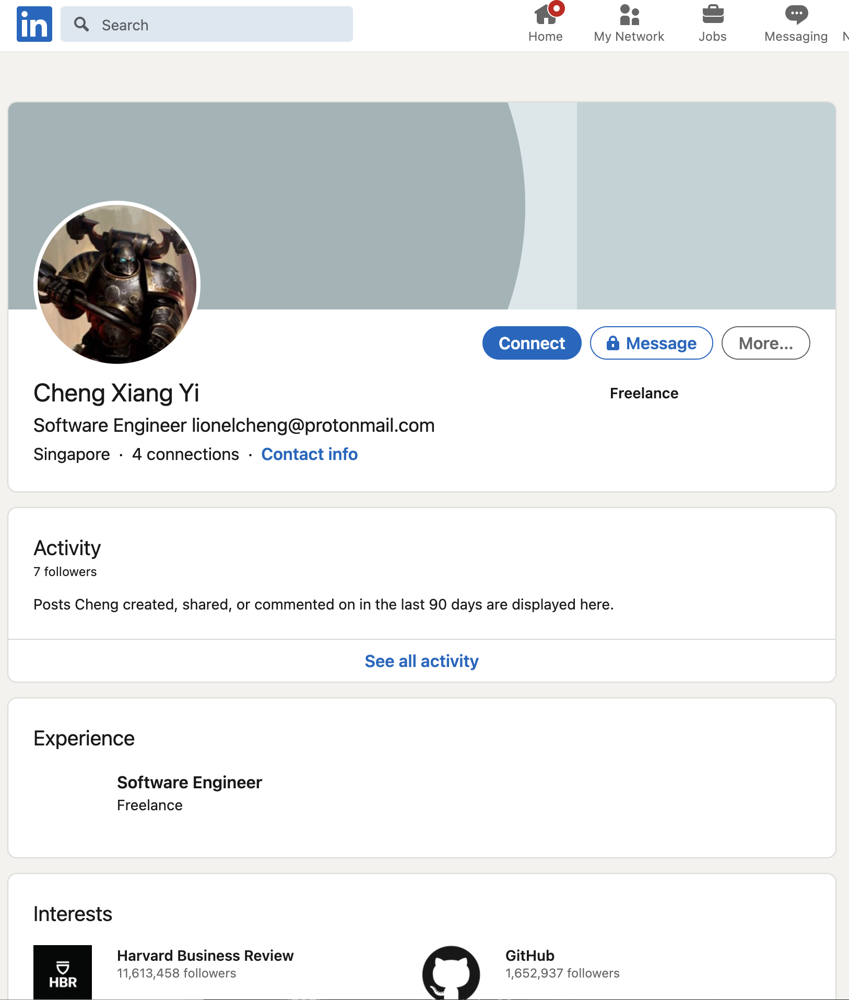

Let us now shift our focus to his [Strava profile](https://www.strava.com/athletes/70911754) 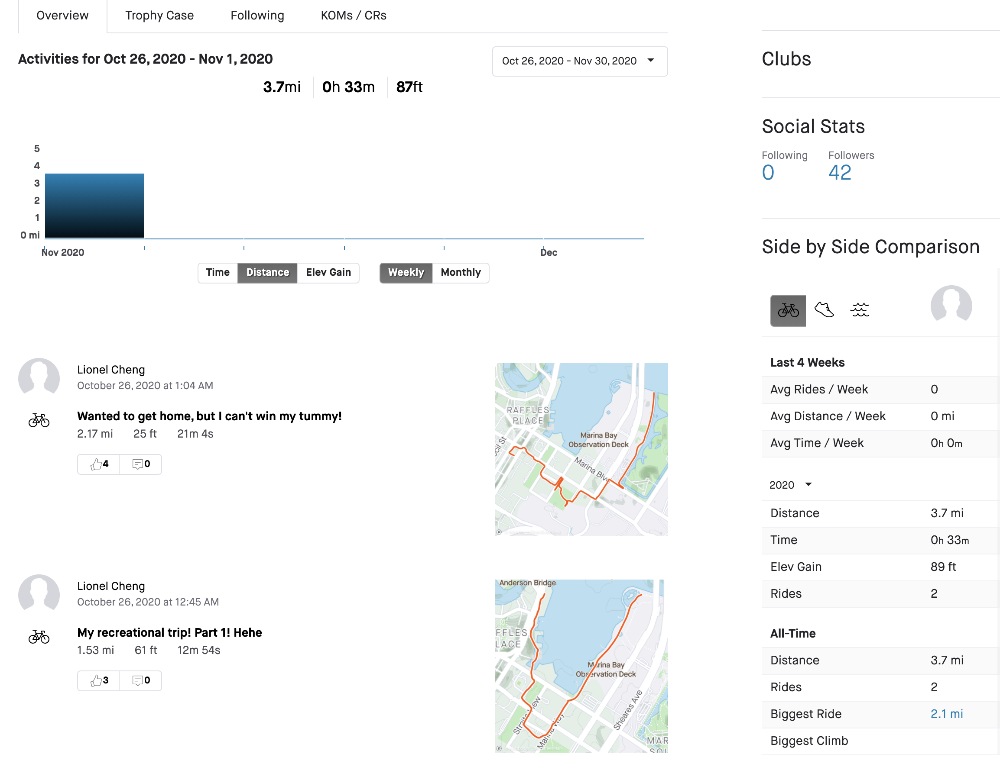
Here, we see that he has two public entries, though there may not seem like much, we can actually follow him to obtain more information of his posts, this was something that my teammate noticed, which led us to his postal code **018935** at Marina One Residences, of which postal code I previously tried but was incorrect.
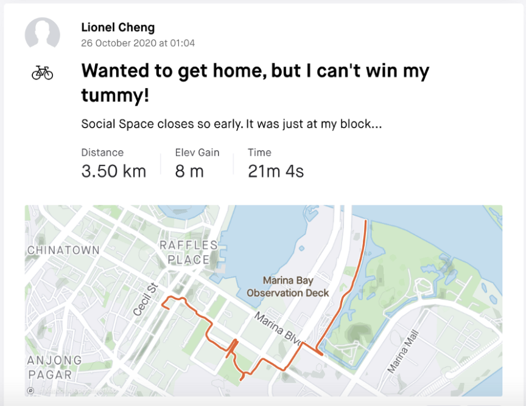
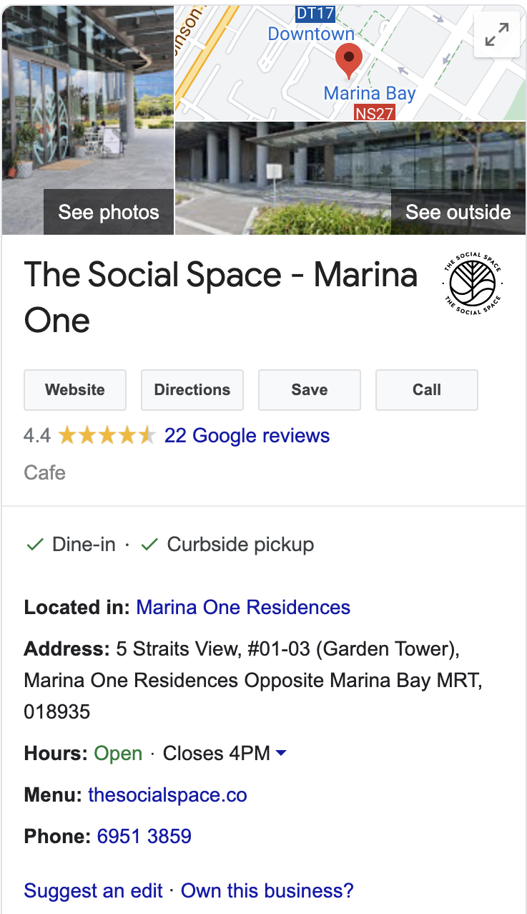

Now the last thing we need is his mobile number, initially I overlooked the results from Google search and missed his Carousell account. It was only when I went back to the results that I noticed his contact number was included in his Carousell listings.  Hence we have the 9-digit contact number **963672918**.

Thus the constructed flag is:
> **govtech-csg{LionelChengXiangYi-963672918-018935}**

## **Learning Resources/References:**
- For those interested in OSINT, [sherlock](https://github.com/sherlock-project/sherlock) is an interesting SOCMINT tool that allows you to enumerate a bunch of social media sites for a given username. Using lionelcxy as our example here, we can enumerate common social media sites with this username very quickly and efficiently, though it was not necessary for this challenge. *Take note that there tends to be some false positives.*
> python3 sherlock lionelcxy
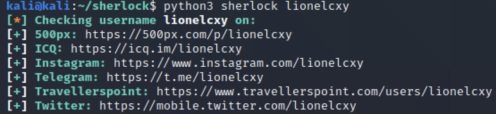

To make use of this results, we can go to his [Twitter](https://twitter.com/lionelcxy) and take a look at his only post which actually links us to his Carousell listing and consequently his mobile number. 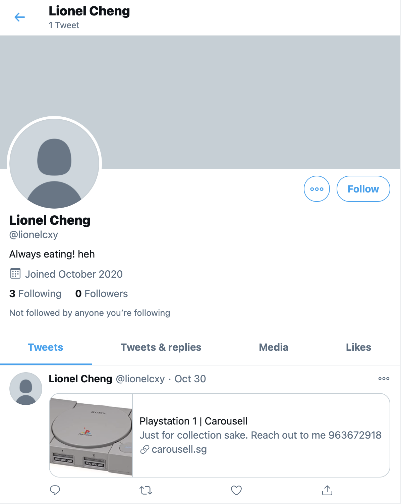 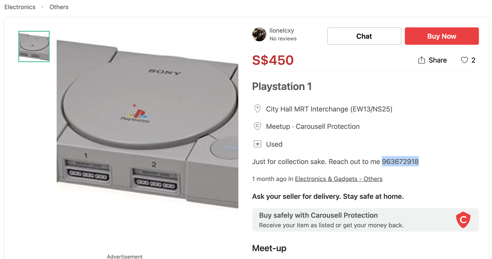 This aligns with and corroborates with our previous Google search results.
