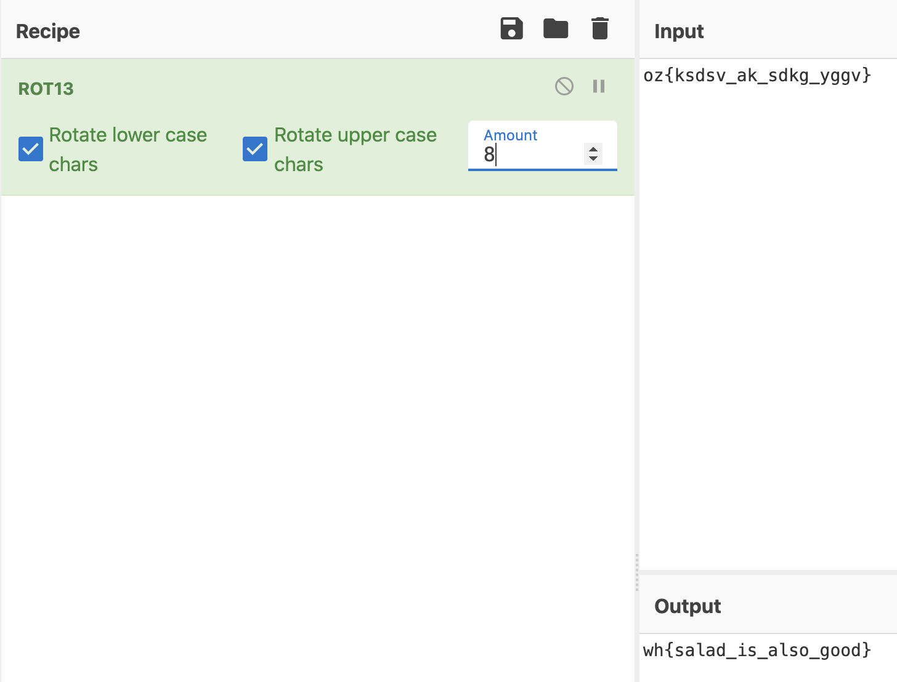

# et tu brutus?
**Points: 100**

Prompt: oz{ksdsv_ak_sdkg_yggv}

We are given a prompt that resembles a flag, but we know nothing of how to get it into a flag. 
Googling "et tu brutus", we find that it is the last words of Julius Caesar, who happens to also be famous for the Caesar Cipher aka [ROT13](https://en.wikipedia.org/wiki/Caesar_cipher).

Going over to [CyberChef](http://icyberchef.com/), my favourite tool for dealing with conversions and encodings, we throw in ROT13 and the given prompt. As ROT13 is fairly simple, we can just bruteforce the key which gives us the flag:

> wh{salad_is_also_good}
