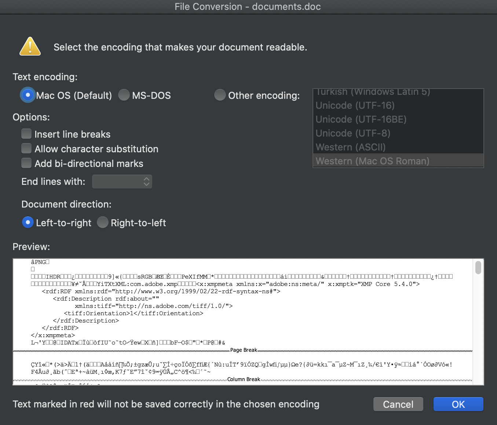
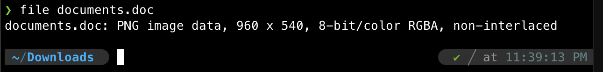

# always has been 
**Points: 100**

Prompt: "This document seems corrupted, I guess we should delete it."
File provided: "[documents.doc](documents.doc)"

Well please don't actually believe them, deleting the file will not give you the flag :D

Opening the file in Microsoft Word would give us an error.
Peering into the file using Word, we see the PNG file signature at the top.

When a file is "corrupted" it is also a possibility where the data is not understood by the application designated to open files with that file extension.
To further confirm this, we can run this in terminal: 
> file documents.doc

Now, renaming the file as documents.png instead, opening the image, we get the flag:

> wh{4lway5_h4s_b3en}
