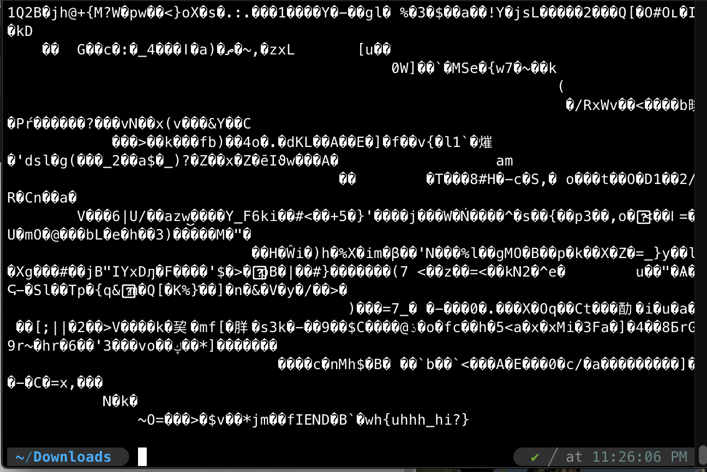

# internal text
**Points: 100**

Presented with a question: "Data is just 0 and 1 right?" and a file: "[okay.png](okay.png)"

Taking the time to understand the question, we do know that data is represented in binary to computers. 

However, data is represented to us through certain character-encodings, the fastest way to view binary data and see if it represents any legible string would be to just make use of the terminal: 
> cat okay.png

We are then presented with the flag at the end of the file:
> **wh{uhhh_hi?}**
