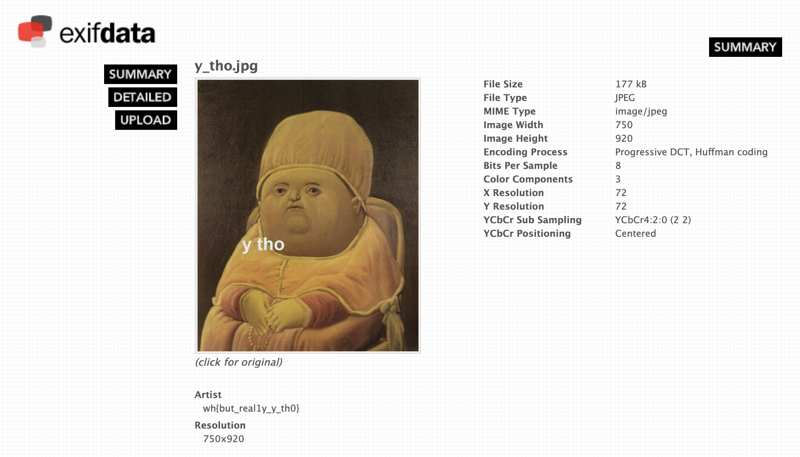

# metadata
**Points: 100**

Prompt: "Who made this?" 

File: "[y_tho.jpg](y_tho.jpg)"

Looking at the challenge name, we can guess that it might have something to do with the EXIF data seeing as it is a *.jpg file.

There is an abundance of EXIF viewing tools, but I chose an online option [exifdata.com](exifdata.com)

Uploading the file then gave us the flag:
> **wh{but_real1y_y_th0}**
