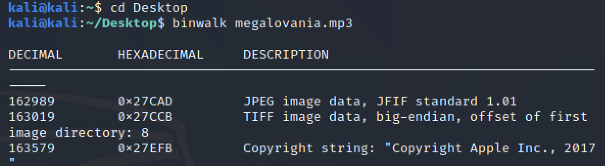
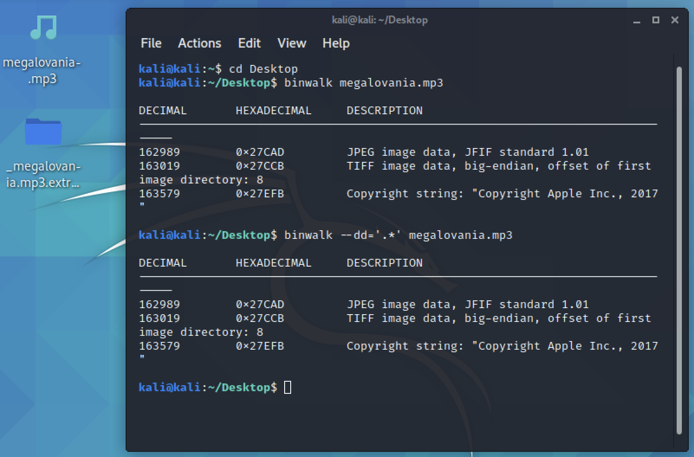

# musical walks
**Points: 200**

Prompt: "Something seems fishy about this music..."
File provided: "[megalovania.mp3](megalovania.mp3)"

Now I was lost for this one and had to use a hint (oops):

**binwalk** was the hint, hence the walk in musical walks. This tool should instantly ring a bell, it's used to analyse embedded files!

Opening up my terminal with binwalk installed, I ran this:
>binwalk megalovania.mp3

So here, we see that there is an embedded JPEG image within the *.mp3

We will now use binwalk to extract it as well. Using this command, I could extract all the contents of the file:

>binwalk --dd='.*' megalovania.mp3

Inside the folder "_megalovania.mp3.extracted", we would then see a file titled "[27CAD](27CAD.jpg)". Knowing that they are JPEG files, we just needed to add the extension and open them which displayed the flag:

> wh{wh4t}
