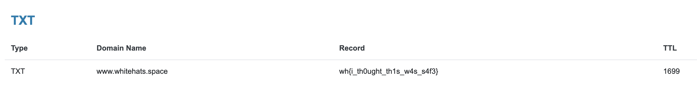

# how do urls work?
**Points: 120**

Prompt: "There must be records stored somewhere."

The word records would remind you of the DNS records that contain information of registered URLs.
To act on this information, I used a DNS lookup tool online, link [here](https://dnschecker.org/all-dns-records-of-domain.php)

After input of the URL for the CTF site, scrolling down, we get the flag:

> wh{i_th0ught_th1s_w4s_s4f3}
