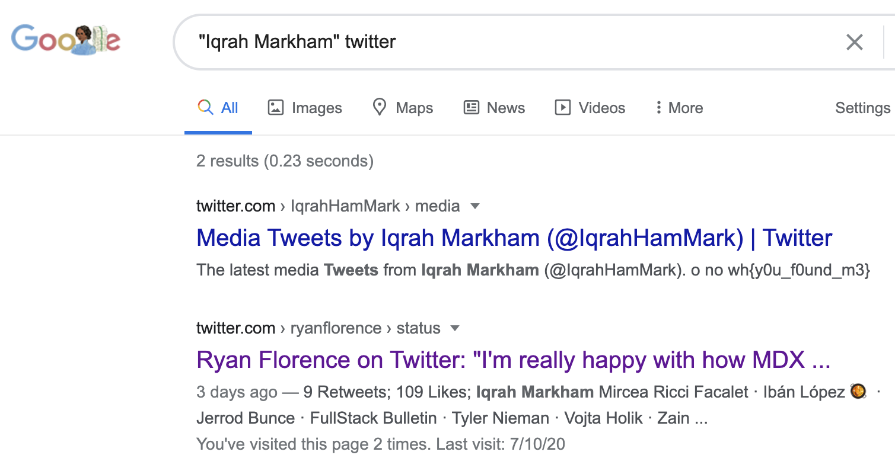

# tweet!
**Points: 100**

Prompt:
"We've found someone interesting, but we only have their name... Who is **Iqrah Markham**?"

Doing a Google search of "Iqrah Markham twitter" (twitter as derived from tweet), we are presented with the following that is not of much use:
>

Tweaking the search to necessitate the inclusion of Iqrah Markham in the results, we now try with **>"Iqrah Markham" twitter<**:
>

> Flag is: wh{y0u_f0und_m3}

For those curious, this is [Iqrah Markham](https://twitter.com/IqrahHamMark)
