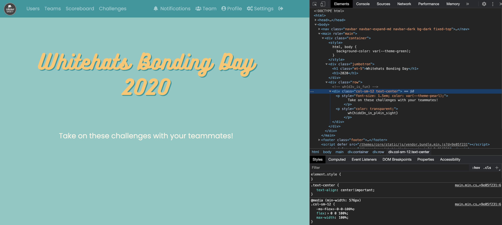

# hidden in plain sight
**Points: 100**

Prompt: "Our homepage seems awfully blank..."

Going to the [homepage](http://www.whitehats.space/) of the CTF page, we now use the Inspect Element function of Google Chrome (this may vary for other browsers).

Expanding several elements, we can already see the flag in plain sight:

> wh{hidd3n_in_pl4in_sight}
