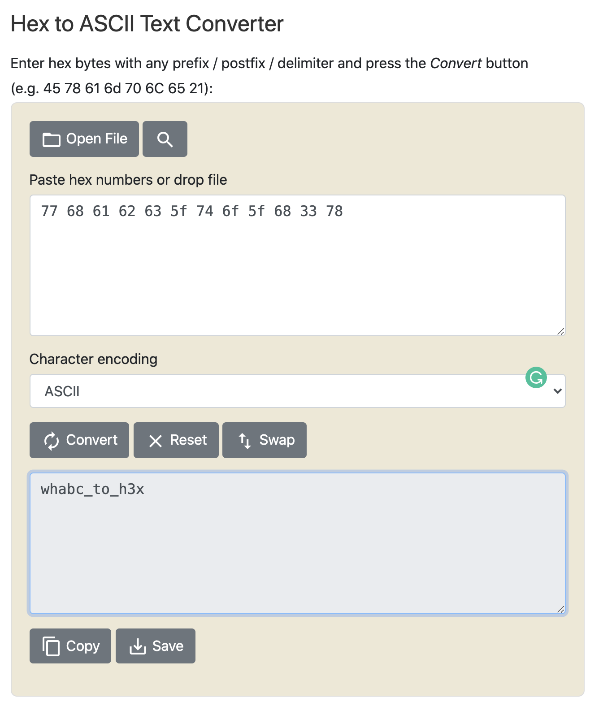

# hex
**Points: 100**

Prompt: 77 68 61 62 63 5f 74 6f 5f 68 33 78

This is fairly straightforward, just convert hex to ASCII to view the flag.
Plenty of tools online but I used [this](https://www.rapidtables.com/convert/number/hex-to-ascii.html):

Converting it into the format of a flag, we get:
> wh{abc_to_h3x}
