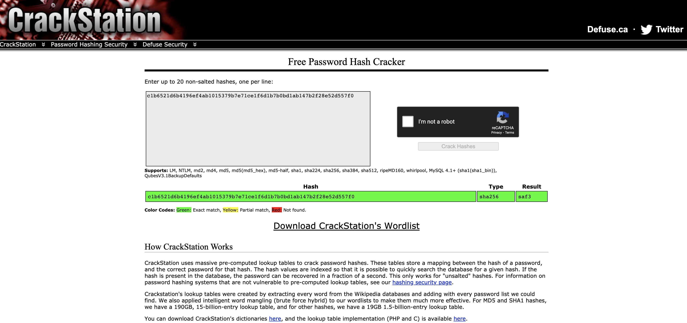

# passwords
**Points: 120**

Prompt: "We stole a password from someone, but it’s hashed! How will we solve this? The flag should be in the format wh{<flag>}."
Files provided: "[passwords.txt](passwords.txt)"

Opening up passwords.txt, we see what looks to be the hash for a password. 
Instinctively, I went over to [crackstation.net](https://crackstation.net/), my favourite repository of commonly hashed words. 
Alternatively, we can use johntheripper for more complex passwords/salted passwords.

Putting the hash in, we managed to get a plaintext result with sha256 as the hashing algorithm:

> Flag: wh{saf3}
