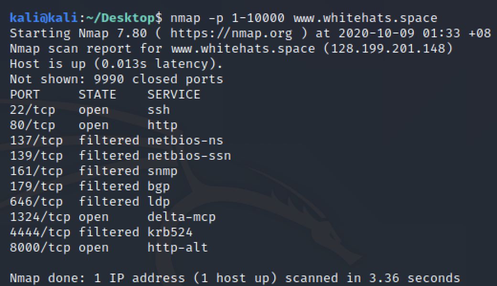
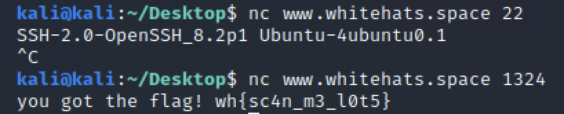

# hidden services
**Points: 200**

Prompt: "There's a rogue service running on this website. Help us find it!"

An invitation to be portscanned, we now open up our terminal to run nmap:
> nmap -p 1-10000 www.whitehats.space

We use 1-10000 to increase the scan range from the default well known ports. Note that there is a likelihood the port number may be larger than 10000, but I was lucky here.
More on type of ports [here](https://en.wikipedia.org/wiki/Registered_port)

From the result, we already see a suspicious port 22 (from a sysadmin perspective, this should not be open to the Internet) and an unknown port 1324.
Attempting to connect to them using nc (netcat), we don't get much success from port 22, but obtain the flag from port 1324:

>wh{sc4n_m3_l0t5}
