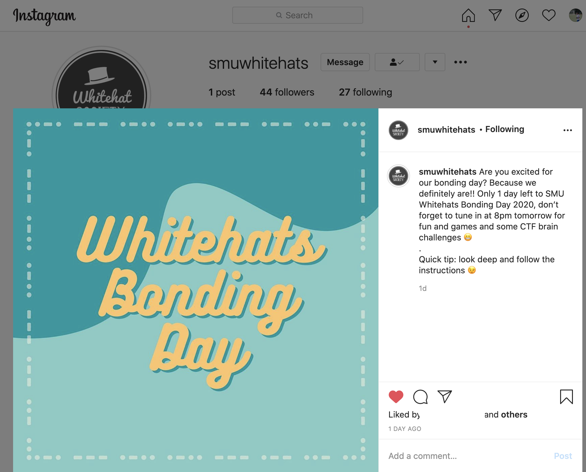
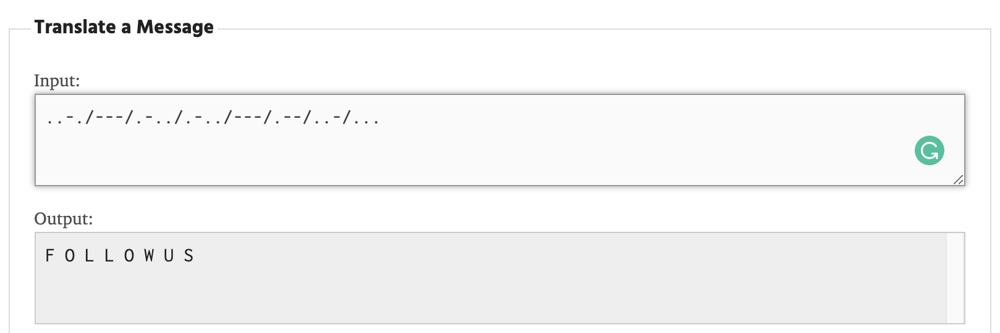
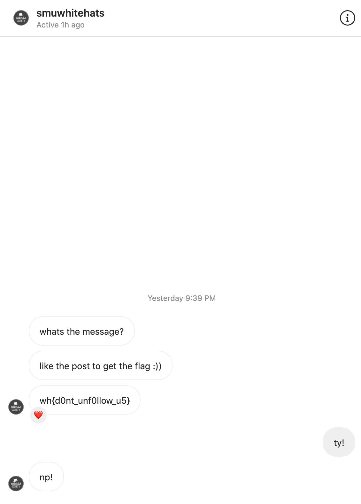

# social media
**Points: 150**

Prompt: "There are rumours that the marketing director of Whitehats is trying to send a secret message. Maybe she’s hidden some instructions on our social media?"
Hint: "Maybe you should act on the instruction"

One of the more interesting challenges, we first head over to the [Instagram page](https://www.instagram.com/smuwhitehats/) of Whitehats, as it was the only social media advertised on their website.

There was only one post at the time, which had what looked to be Morse Code as the borders of the image as well as a tip to **look deep into the instructions**.

Pulling up a [Morse Code decoder](https://morsecode.world/international/translator.html), this was what I got:

Now using the hint, and following Whitehats, I received a DM and some instructions and obtained the flag:

> wh{d0nt_unf0llow_u5}
