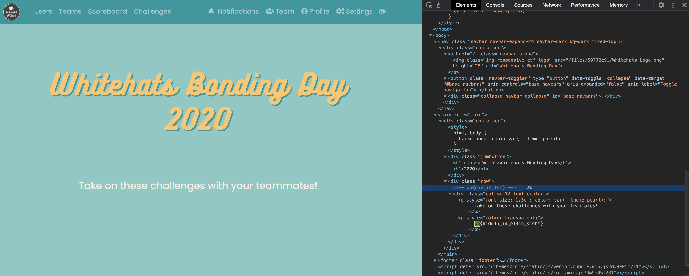

# leave good comments
**Points: 100**

Prompt: "Did you know you can leave HTML comments?"

In any language, comments are crucial part of documentation, this applies for HTML as well.

Inspecting the [homepage](http://www.whitehats.space/) once again, we must look harder now.. Or maybe we just look smarter, let's search for the flag.
Using 'wh' as the search input, we find find the flag as a comment, hidden in the HTML:

> wh{d3v_is_fun}
